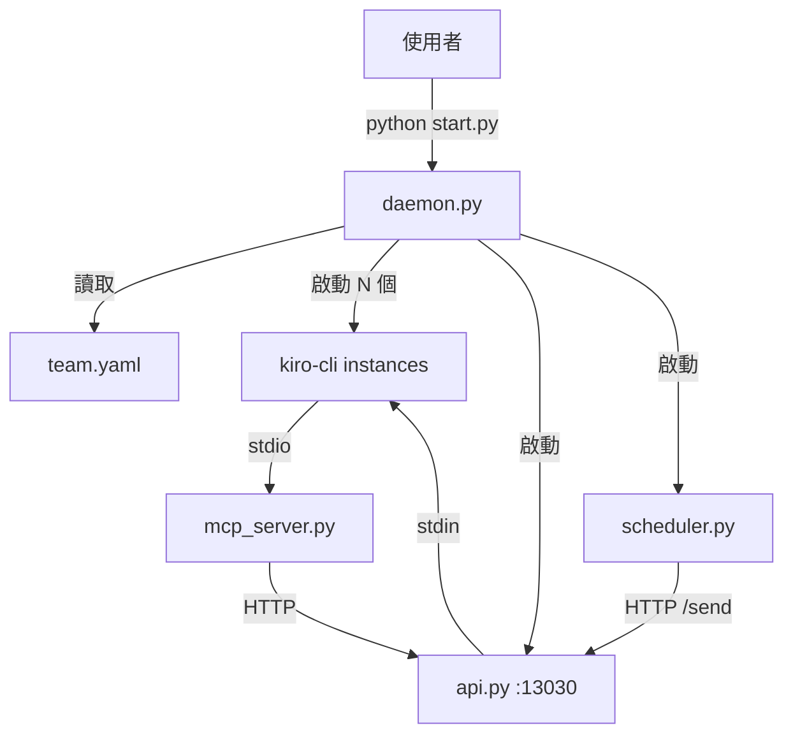

# 系統架構

## 總覽



## 資料流

```
啟動：
  start.py → daemon.run()
    → config.load_config("team.yaml")
    → for each instance:
        backend.write_steering()     # 寫 .kiro/
        backend.write_mcp_config()   # 注入 MCP
        backend.build_command()      # 組裝命令
        process.start(cmd, cwd)      # 啟動 kiro-cli
    → api.start(port=13030)          # HTTP server
    → scheduler.start()              # cron 排程

Agent 間通訊：
  Agent A 呼叫 MCP tool "send_to_instance"
    → mcp_server.py 收到 JSON-RPC request
    → HTTP POST http://localhost:13030/send/{target}
    → api.py 收到 → 寫入 target instance 的 stdin
    → target kiro-cli 收到訊息，開始處理

排程觸發：
  scheduler.py cron 到點
    → HTTP POST http://localhost:13030/send/{target}
    → 同上
```

## 與 ark-team-agent 的差異

| | ark-team-agent（套件） | ark-agent-teams-builder（Skill 產出） |
|---|---|---|
| 安裝 | `pip install ark-team-agent` | 不需安裝，產出即用 |
| 啟動 | `ark-team-agent team start` | `python start.py` |
| 程式碼位置 | site-packages/ | 專案內 runtime/ |
| 依賴 | pyyaml + python-telegram-bot + ... | 僅 pyyaml |
| Telegram | 內建 | 不含（用 ark-chatbot 獨立加） |
| 行數 | ~250KB（16 模組） | ~900 行（7 模組） |
| 更新 | pip upgrade | 手動或重新產出 |

## 擴充路徑

```
基礎系統（ark-agent-teams-builder 產出）
  │
  ├── 加 Telegram → 在 leader-agent/ 下跑 /ark-chatbot
  ├── 加 Web UI → 在某 agent/ 下跑 /ark-webapp
  ├── 加工作流 → 在某 agent/ 下跑 /ark-scheduler
  └── 加知識庫 → 跑 /ark-wiki-engine
```
