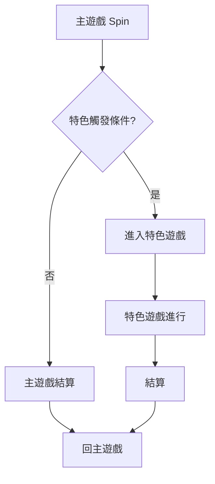

# <遊戲名> 機率規格書（Content 軌）

## 1. 規格簡述

### 基本規格

| 項目 | 值 | 來源 |
|---|---|---|
| 盤面 | | |
| 線數 | | |
| 基本收費 | | |

### 機率人員簡述

<!-- human:summary -->
（2–4 句：主遊戲怎麼得分、特色怎麼觸發、特色遊戲型態；數字請標來源）
<!-- /human -->

## 2. 數據資料

> 未快測。跑快測後由 ps_probspec 自動填入；手寫版請整表留「—」。

| 階段 | RTP | Freq | Trigger % | 平均倍率 | 最大倍率 |
|---|---|---|---|---|---|
| 主遊戲 | — | — | — | — | — |
| 免費遊戲 | — | — | — | — | — |
| 總計 | — | — | — | — | — |

## 3. 機率流程圖

### 流程補充

<!-- human:flow-notes -->
（每個節點標對應的表編號）
<!-- /human -->

## 4. 參數表

> 每一列最後一欄為「來源」（xlsx 座標 / 決議 D-id / config 鍵）；沒定案的值寫「待決議」且不帶來源。

### 表 M-1　<標題>

| Index | R1 | R2 | R3 | R4 | R5 | 權重 | 說明 | 來源 |
|---|---|---|---|---|---|---|---|---|

### 參數備註

<!-- human:param-notes -->
<!-- /human -->

## 5. 競品資料／手法對應

<!-- human:competitor -->
| 機制（參數表） | 說明 | 對應手法卡 | 收錄目的 |
|---|---|---|---|
| 表 M-1 … | | K-022 | |
<!-- /human -->

## 6. 隱性規則

<!-- human:hidden-rules -->
| 規則 | 設計目的 | 對應表 / K 卡 | 更改需同步 |
|---|---|---|---|
| | | | |
<!-- /human -->

## 邊界聲明

- 本檔為手寫起手式（mode: manual）；進入 xlsx 或 qt 模式後由腳本重產，人工區保留。
