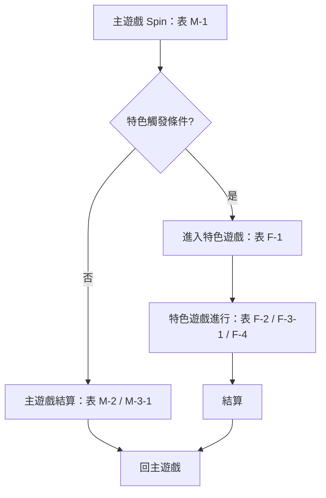

# 彌勒佛 機率規格書（Content 軌）

## 1. 規格簡述

### 基本規格

| 項目 | 值 | 來源 |
|---|---|---|
| 盤面 | 3x5 | 參數表 基本資訊 |
| 線數 | All Ways | 參數表 基本資訊 |
| 基本收費 | 132 | 參數表 基本資訊 |

### Pay table（odds × Line bet）

| 層級 | 符號 | x3 | x4 | x5 | 來源 |
|---|---|---|---|---|---|
| High Pay Symbols | M1 | 20 | 60 | 250 | 參數表 Odds表 |
| High Pay Symbols | M2 | 15 | 50 | 200 | 參數表 Odds表 |
| High Pay Symbols | M3 | 15 | 25 | 150 | 參數表 Odds表 |
| High Pay Symbols | M4 | 10 | 20 | 100 | 參數表 Odds表 |
| High Pay Symbols | M5 | 10 | 15 | 50 | 參數表 Odds表 |
| Low Pay Symbols | FA | 5 | 8 | 10 | 參數表 Odds表 |
| Low Pay Symbols | FK | 5 | 8 | 10 | 參數表 Odds表 |
| Low Pay Symbols | FQ | 5 | 8 | 10 | 參數表 Odds表 |

### xlsx「規格簡述」分頁（原文）

- **SPEC** 主遊戲
- **SPEC** 五輪 5*5  50lines
- **SPEC** 連線後如果有經過wild 則wild會進行乘倍抽選
- **SPEC** 免費遊戲
- **SPEC** 五輪 5*5　每行上方各有一個數字1
- **SPEC** 進行8手
- **SPEC** 如果轉出寶箱則會開出乘倍 將對應行數的數字做乘倍
- **SPEC** 8手結束後 上方數字相加最後程上line bet即是總獎金
- **SPEC** extrabet ｜ 左方每列初始也各有一個1
- **SPEC** 寶箱打開時 對應列數的數字也能乘倍

### 機率人員簡述

<!-- human:summary -->
（請以 2–4 句描述 彌勒佛 的主遊戲與特色觸發方式；此區重產保留）
<!-- /human -->

## 2. 數據資料

### 快測基本資訊（BASE INFO）

| 階段 | RTP | Freq（每幾手） | Trigger % | 平均倍率 | PlayTimes | RetriRate | 最大倍率 |
|---|---|---|---|---|---|---|---|
| 主遊戲 | 39.0500% | 2.52 | 39.6931% | 0.98 | — | — | 368.18 |
| 免費遊戲 | 60.8895% | 223.47 | 0.4475% | 136.07 | 1.00 | 0.00% | 31120.36 |
| Feature | 0.0000% | — | 0.0000% | 0.00 | — | — | — |
| GRAND | 0.0000% | — | 0.0000% | 0.00 | — | — | — |
| 總計 | 99.9395% | — | — | — | — | — | — |

- 快測執行：總手數 1,000,000,000；執行時間 2026-10-01 11:52；旗標 開MAXWIN；耗時 252.87 s

- golden（參數表 M-1 加權 TOTAL RTP）：100.03%；實測總 RTP 99.9395%；誤差 -0.088 pp（容許 ± 0.2 pp）。**RTP 是模擬結果不是輸入**（P-000）。

### FG 強中弱實測分佈

| 組別 | 次數 | 佔比 | FG RTP 貢獻 |
|---|---|---|---|
| 超強 | 45,052 | 1.01% | 9.24% |
| 強 | 850,270 | 19.00% | 25.36% |
| 中 | 3,132,594 | 70.00% | 60.16% |
| 弱 | 446,978 | 9.99% | 5.24% |

> 完整快測輸出見 View 軌（prob-spec.html §2）與 prob-data.json `raw_log`；本節只列守門用數字。

## 3. 機率流程圖

> 骨架由參數表的表編號自動帶出；分支條件與演出層請在下方「流程補充」補齊（重產保留）。

### 流程補充

<!-- human:flow-notes -->
（可在此放完整 mermaid 或逐步說明；每個節點標對應的表編號）
<!-- /human -->

## 4. 參數表

> 每一列的「來源」= xlsx 座標（分頁!儲存格）。數值為定案值（source: xlsx，pending_params 0）。

### 基本資訊　盤面

| 基本資訊 |   | 盤面 | 3x5 | 來源 |
|---|---|---|---|---|
|  |  | 線數 | All Ways | 參數表!A3 |
|  |  | 基本收費 | 132 | 參數表!A4 |

### Odds表　Pay table

| Description | Symbol | 3 | 4 | 5 | 來源 |
|---|---|---|---|---|---|
| High Pay Symbols | M1 | 20 | 60 | 250 | 參數表!C8 |
|  | M2 | 15 | 50 | 200 | 參數表!C9 |
|  | M3 | 15 | 25 | 150 | 參數表!C10 |
|  | M4 | 10 | 20 | 100 | 參數表!C11 |
|  | M5 | 10 | 15 | 50 | 參數表!C12 |
| Low Pay Symbols | FA | 5 | 8 | 10 | 參數表!C13 |
|  | FK | 5 | 8 | 10 | 參數表!C14 |
|  | FQ | 5 | 8 | 10 | 參數表!C15 |

### 表 M-1　Main Game轉輪帶設定

| Index | R1 | R2 | R3 | R4 | R5 | Weight | 組合說明 |   |   |   | TOTAL RTP | FG RTP | 來源 |
|---|---|---|---|---|---|---|---|---|---|---|---|---|---|
| 0 | 0 | 0 | 0 | 0 | 0 | 40 | SC顆數最多12顆/會出現特殊SS |  |  |  | 2.42264 | 2.076918 | 參數表!C22 |
| 1 | 0 | 0 | 0 | 1 | 0 | 100 | SC顆數最多12顆/會出現特殊SS |  |  |  | 1.274062 | 0.886124 | 參數表!C23 |
| 2 | 0 | 0 | 1 | 0 | 0 | 100 | SC顆數最多12顆/會出現特殊SS |  |  |  | 1.577854 | 1.217855 | 參數表!C24 |
| 3 | 0 | 1 | 0 | 0 | 0 | 100 | SC顆數最多12顆/會出現特殊SS |  |  |  | 1.620408 | 1.236401 | 參數表!C25 |
| 4 | 1 | 0 | 0 | 0 | 0 | 100 | SC顆數最多12顆/會出現特殊SS |  |  |  | 1.443309 | 1.057528 | 參數表!C26 |
| 5 | 0 | 0 | 0 | 0 | 1 | 100 | SC顆數最多12顆/不會出現特殊SS |  |  |  | 0.714701 | 0.342676 | 參數表!C27 |
| 6 | 0 | 0 | 0 | 1 | 1 | 115 | SC顆數最多12顆/不會出現特殊SS |  |  |  | 0.499947 | 0.081804 | 參數表!C28 |
| 7 | 0 | 0 | 1 | 0 | 1 | 115 | SC顆數最多12顆/不會出現特殊SS |  |  |  | 0.521205 | 0.134009 | 參數表!C29 |
| 8 | 0 | 1 | 0 | 0 | 1 | 115 | SC顆數最多12顆/不會出現特殊SS |  |  |  | 0.544952 | 0.131349 | 參數表!C30 |
| 9 | 1 | 0 | 0 | 0 | 1 | 115 | SC顆數最多12顆/不會出現特殊SS |  |  |  | 0.523806 | 0.110254 | 參數表!C31 |
|  |  |  |  |  |  |  |  |  |  |  | 1.0002786500000003 | 0.60973796 | 參數表!C32 |

| c1 | 來源 |
|---|---|
| 1,000 | 參數表!I34 |

### 表 M-2　假轉的SC/SS 或是 不會進FG的MG盤面，由下面表格抽取

|   | SC |   |   |   | SS |   | 來源 |
|---|---|---|---|---|---|---|---|
| M-2-1 | 圖騰倍數(Line bet) | Weight |  | M-2-2 | 圖騰倍數(Line bet) | Weight | 參數表!B39 |
|  | 8 | 18 |  |  | 1,288 | 18 | 參數表!B40 |
|  | 18 | 16 |  |  | 1,888 | 16 | 參數表!B41 |
|  | 38 | 14 |  |  | 2,888 | 14 | 參數表!B42 |
|  | 68 | 12 |  |  | 3,888 | 12 | 參數表!B43 |
|  | 88 | 10 |  |  | 6,888 | 10 | 參數表!B44 |
|  | 188 | 8 |  |  | 8,888 | 8 | 參數表!B45 |
|  | 388 | 8 |  |  | *2 | 8 | 參數表!B46 |
|  | 688 | 8 |  |  | *3 | 8 | 參數表!B47 |
|  | 888 | 6 |  |  | *4 | 6 | 參數表!B48 |
|  |  | 100 |  |  |  | 100 | 參數表!B49 |
|  | 均倍 | 181 |  |  |  |  | 參數表!B50 |

### 表 M-3-1　會進FG的盤面，根據組別過以下權重決定是否出現群預告

|   | 是 | 否 | 來源 |
|---|---|---|---|
| 超強 | 100 | 0 | 參數表!B55 |
| 強 | 50 | 50 | 參數表!B56 |
| 中 | 0 | 100 | 參數表!B57 |
| 弱 | 0 | 100 | 參數表!B58 |

### 表 M-3-2　有群預告時，根據組別過以下權重決定SC是否全放888，若沒過則SC分數由M-5判斷

|   | 是 | 否 | 來源 |
|---|---|---|---|
| 超強 | 10 | 90 | 參數表!B63 |
| 強 | 5 | 95 | 參數表!B64 |
| 中 | 0 | 100 | 參數表!B65 |
| 弱 | 0 | 100 | 參數表!B66 |

### 表 M-4　前四輪出現6顆以上SC，且第五輪至少有一顆SS時，過以下權重決定第五輪是否要變成彩色聽牌

|   | 權重 | 來源 |
|---|---|---|
| 是 | 50 | 參數表!B71 |
| 否 | 50 | 參數表!B72 |

### 表 M-5　進入FG時的 SC/SS的圖騰分數，由下面表格抽取

|   | SC |   |   |   | SS |   |   | 來源 |
|---|---|---|---|---|---|---|---|---|
| M-2-1 | 圖騰倍數(Line bet) | Weight |  | M-2-2 | 圖騰倍數(Line bet) | Weight |  | 參數表!B78 |
|  | 8 | 250 |  |  | 1,288 | 400 |  | 參數表!B79 |
|  | 18 | 40 |  |  | 1,888 | 90 |  | 參數表!B80 |
|  | 38 | 60 |  |  | 2,888 | 60 |  | 參數表!B81 |
|  | 68 | 100 |  |  | 3,888 | 20 |  | 參數表!B82 |
|  | 88 | 450 |  |  | 6,888 | 7 |  | 參數表!B83 |
|  | 188 | 40 |  |  | 8,888 | 3 |  | 參數表!B84 |
|  | 388 | 7 |  |  | *2 | 220 |  | 參數表!B85 |
|  | 688 | 3 |  |  | *3 | 120 |  | 參數表!B86 |
|  | 888 | 50 |  |  | *4 | 80 |  | 參數表!B87 |
|  |  | 1,000 |  |  |  | 1,000 | 1743.1724137931035 | 參數表!B88 |
|  | 均倍 | 108.1 |  |  |  |  |  | 參數表!B89 |

### 表 F-1　決定強中弱組

| 組別 | 權重 | 來源 |
|---|---|---|
| 超強 | 1 | 參數表!C95 |
| 強 | 19 | 參數表!C96 |
| 中 | 70 | 參數表!C97 |
| 弱 | 10 | 參數表!C98 |

### 表 F-2　FG 組別 → 金幣 / 鯉魚 / 金龍 / 彩龍 之出現次數與分數

| 金幣・出現次數（權重） |   |   |   |   |   |   |   |   | 來源 |
|---|---|---|---|---|---|---|---|---|---|
| 組別 | 0 | 1 | 2 | 3 | 4 | 5 | 權重和 | 平均次數 | 參數表!A104 |
| 超強 | 100 | 0 | 0 | 0 | 0 | 0 | 100 | 0 | 參數表!A105 |
| 強 | 0 | 25 | 50 | 25 | 0 | 0 | 100 | 2 | 參數表!A106 |
| 中 | 0 | 10 | 30 | 60 | 0 | 0 | 100 | 2.5 | 參數表!A107 |
| 弱 | 0 | 0 | 25 | 75 | 0 | 0 | 100 | 2.75 | 參數表!A108 |
| 機率 Prob. |  |  |  |  |  |  |  |  | 參數表!A109 |
| 超強 | 1 | 0 | 0 | 0 | 1 |  |  |  | 參數表!A110 |
| 強 | 0 | 0.25 | 0.5 | 0.25 | 1 |  |  |  | 參數表!A111 |
| 中 | 0 | 0.1 | 0.3 | 0.6 | 1 |  |  |  | 參數表!A112 |
| 弱 | 0 | 0 | 0.25 | 0.75 | 1 |  |  |  | 參數表!A113 |

| 金幣・分數 Odds（權重） |   |   |   |   |   |   | 來源 |
|---|---|---|---|---|---|---|---|
| 組別 | 18 | 38 | 68 | 88 | 權重和 | 平均分數 | 參數表!A116 |
| 超強 | 60 | 30 | 9 | 1 | 100 | 29.2 | 參數表!A117 |
| 強 | 60 | 30 | 9 | 1 | 100 | 29.2 | 參數表!A118 |
| 中 | 60 | 30 | 9 | 1 | 100 | 29.2 | 參數表!A119 |
| 弱 | 60 | 30 | 9 | 1 | 100 | 29.2 | 參數表!A120 |
| 機率 Prob. |  |  |  |  |  |  | 參數表!A121 |
| 超強 | 0.6 | 0.3 | 0.09 | 0.01 | 1 |  | 參數表!A122 |
| 強 | 0.6 | 0.3 | 0.09 | 0.01 | 1 |  | 參數表!A123 |
| 中 | 0.6 | 0.3 | 0.09 | 0.01 | 1 |  | 參數表!A124 |
| 弱 | 0.6 | 0.3 | 0.09 | 0.01 | 1 |  | 參數表!A125 |

| 鯉魚・出現次數（權重） |   |   |   |   |   |   |   |   |   |   |   |   |   | 來源 |
|---|---|---|---|---|---|---|---|---|---|---|---|---|---|---|
| 組別 | 0 | 1 | 2 | 3 | 4 | 5 | 6 | 7 | 8 | 9 | 10 | 權重和 | 平均次數 | 參數表!A128 |
| 超強 | 0 | 0 | 0 | 0 | 0 | 50 | 30 | 10 | 6 | 3 | 1 | 100 | 5.85 | 參數表!A129 |
| 強 | 0 | 0 | 0 | 25 | 35 | 20 | 10 | 6 | 3 | 1 | 0 | 100 | 4.5 | 參數表!A130 |
| 中 | 0 | 0 | 20 | 30 | 30 | 20 | 0 | 0 | 0 | 0 | 0 | 100 | 3.5 | 參數表!A131 |
| 弱 | 0 | 0 | 60 | 30 | 10 | 0 | 0 | 0 | 0 | 0 | 0 | 100 | 2.5 | 參數表!A132 |
| 機率 Prob. |  |  |  |  |  |  |  |  |  |  |  |  |  | 參數表!A133 |
| 超強 | 0 | 0 | 0 | 0 | 0 | 0 |  |  |  |  |  |  |  | 參數表!A134 |
| 強 | 0 | 0 | 0 | 0.25 | 0.35 | 0.6 |  |  |  |  |  |  |  | 參數表!A135 |
| 中 | 0 | 0 | 0.2 | 0.3 | 0.3 | 0.8 |  |  |  |  |  |  |  | 參數表!A136 |
| 弱 | 0 | 0 | 0.6 | 0.3 | 0.1 | 0.9999999999999999 |  |  |  |  |  |  |  | 參數表!A137 |

| 鯉魚・分數 Odds（權重） |   |   |   |   |   |   | 來源 |
|---|---|---|---|---|---|---|---|
| 組別 | 188 | 388 | 688 | 888 | 權重和 | 平均分數 | 參數表!A140 |
| 超強 | 0 | 0 | 0 | 100 | 100 | 888 | 參數表!A141 |
| 強 | 60 | 30 | 9 | 1 | 100 | 300 | 參數表!A142 |
| 中 | 60 | 30 | 9 | 1 | 100 | 300 | 參數表!A143 |
| 弱 | 60 | 30 | 9 | 1 | 100 | 300 | 參數表!A144 |
| 機率 Prob. |  |  |  |  |  |  | 參數表!A145 |
| 超強 | 0 | 0 | 0 | 1 | 1 |  | 參數表!A146 |
| 強 | 0.6 | 0.3 | 0.09 | 0.01 | 0.9999999999999999 |  | 參數表!A147 |
| 中 | 0.6 | 0.3 | 0.09 | 0.01 | 0.9999999999999999 |  | 參數表!A148 |
| 弱 | 0.6 | 0.3 | 0.09 | 0.01 | 0.9999999999999999 |  | 參數表!A149 |

| 金龍・出現次數（權重，倍數固定 ×1） |   |   |   |   |   |   |   |   |   |   |   |   |   |   |   |   |   |   |   |   |   |   |   | 來源 |
|---|---|---|---|---|---|---|---|---|---|---|---|---|---|---|---|---|---|---|---|---|---|---|---|---|
| 組別 | 0 | 1 | 2 | 3 | 4 | 5 | 6 | 7 | 8 | 9 | 10 | 11 | 12 | 13 | 14 | 15 | 16 | 17 | 18 | 19 | 20 | 權重和 | 平均倍數 | 參數表!A152 |
| 超強 | 0 | 0 | 0 | 0 | 0 | 5,000 | 3,000 | 1,000 | 500 | 300 | 100 | 50 | 30 | 10 | 6 | 3 | 1 | 0 | 0 | 0 | 0 | 10,000 | 5.8885 | 參數表!A153 |
| 強 | 0 | 0 | 0 | 5,000 | 3,000 | 1,000 | 500 | 300 | 100 | 50 | 30 | 10 | 6 | 3 | 1 | 0 | 0 | 0 | 0 | 0 | 0 | 10,000 | 3.8885 | 參數表!A154 |
| 中 | 0 | 0 | 5,000 | 3,000 | 1,000 | 500 | 300 | 100 | 50 | 30 | 10 | 6 | 3 | 1 | 0 | 0 | 0 | 0 | 0 | 0 | 0 | 10,000 | 2.8885 | 參數表!A155 |
| 弱 | 0 | 5,000 | 3,000 | 1,000 | 500 | 300 | 100 | 50 | 30 | 10 | 6 | 3 | 1 | 0 | 0 | 0 | 0 | 0 | 0 | 0 | 0 | 10,000 | 1.8885 | 參數表!A156 |
| 機率 Prob. |  |  |  |  |  |  |  |  |  |  |  |  |  |  |  |  |  |  |  |  |  |  |  | 參數表!A157 |
| 超強 | 0 | 0 | 0 | 0 | 0 | 0.5 | 0.3 | 0.1 | 0.05 | 0.03 | 0.01 | 0.005 | 0.003 | 0.001 | 0.0006 | 0.0003 | 0.0001 | 0 | 0 | 0 | 0 | 1 |  | 參數表!A158 |
| 強 | 0 | 0 | 0 | 0.5 | 0.3 | 0.1 | 0.05 | 0.03 | 0.01 | 0.005 | 0.003 | 0.001 | 0.0006 | 0.0003 | 0.0001 | 0 | 0 | 0 | 0 | 0 | 0 | 1 |  | 參數表!A159 |
| 中 | 0 | 0 | 0.5 | 0.3 | 0.1 | 0.05 | 0.03 | 0.01 | 0.005 | 0.003 | 0.001 | 0.0006 | 0.0003 | 0.0001 | 0 | 0 | 0 | 0 | 0 | 0 | 0 | 1 |  | 參數表!A160 |
| 弱 | 0 | 0.5 | 0.3 | 0.1 | 0.05 | 0.03 | 0.01 | 0.005 | 0.003 | 0.001 | 0.0006 | 0.0003 | 0.0001 | 0 | 0 | 0 | 0 | 0 | 0 | 0 | 0 | 1 |  | 參數表!A161 |

| 彩龍・出現次數（權重，倍數固定 ×2） |   |   |   |   |   |   |   |   |   |   |   |   |   |   |   |   |   |   |   |   |   |   |   | 來源 |
|---|---|---|---|---|---|---|---|---|---|---|---|---|---|---|---|---|---|---|---|---|---|---|---|---|
| 組別 | 0 | 1 | 2 | 3 | 4 | 5 | 6 | 7 | 8 | 9 | 10 | 11 | 12 | 13 | 14 | 15 | 16 | 17 | 18 | 19 | 20 | 權重和 | 平均倍數 | 參數表!A164 |
| 超強 | 0 | 0 | 0 | 0 | 0 | 0 | 5,000 | 3,000 | 1,000 | 500 | 300 | 100 | 50 | 30 | 10 | 6 | 3 | 1 | 0 | 0 | 0 | 10,000 | 13.777 | 參數表!A165 |
| 強 | 50 | 30 | 10 | 6 | 3 | 1 | 0 | 0 | 0 | 0 | 0 | 0 | 0 | 0 | 0 | 0 | 0 | 0 | 0 | 0 | 0 | 100 | 1.7 | 參數表!A166 |
| 中 | 60 | 30 | 10 | 0 | 0 | 0 | 0 | 0 | 0 | 0 | 0 | 0 | 0 | 0 | 0 | 0 | 0 | 0 | 0 | 0 | 0 | 100 | 1 | 參數表!A167 |
| 弱 | 80 | 20 | 0 | 0 | 0 | 0 | 0 | 0 | 0 | 0 | 0 | 0 | 0 | 0 | 0 | 0 | 0 | 0 | 0 | 0 | 0 | 100 | 0.4 | 參數表!A168 |
| 機率 Prob. |  |  |  |  |  |  |  |  |  |  |  |  |  |  |  |  |  |  |  |  |  |  |  | 參數表!A169 |
| 超強 | 0 | 0 | 0 | 0 | 0 | 0 | 0.5 | 0.3 | 0.1 | 0.05 | 0.03 | 0.01 | 0.005 | 0.003 | 0.001 | 0.0006 | 0.0003 | 0.0001 | 0 | 0 | 0 | 1.0000000000000002 |  | 參數表!A170 |
| 強 | 0.5 | 0.3 | 0.1 | 0.06 | 0.03 | 0.01 | 0 | 0 | 0 | 0 | 0 | 0 | 0 | 0 | 0 | 0 | 0 | 0 | 0 | 0 | 0 | 1 |  | 參數表!A171 |
| 中 | 0.6 | 0.3 | 0.1 | 0 | 0 | 0 | 0 | 0 | 0 | 0 | 0 | 0 | 0 | 0 | 0 | 0 | 0 | 0 | 0 | 0 | 0 | 0.9999999999999999 |  | 參數表!A172 |
| 弱 | 0.8 | 0.2 | 0 | 0 | 0 | 0 | 0 | 0 | 0 | 0 | 0 | 0 | 0 | 0 | 0 | 0 | 0 | 0 | 0 | 0 | 0 | 1 |  | 參數表!A173 |

**(乘倍有保底乘倍1)**

### 表 F-3-1　表演過以下權重，決定出場順序

|   | 金幣 | 鯉魚 | 金龍 | 彩龍 | Total | 來源 |
|---|---|---|---|---|---|---|
| 前兩次抽取 | 80 | 15 | 5 | 0 | 100 | 參數表!B180 |
| 第三次以後 | 60 | 30 | 7 | 3 | 100 | 參數表!B181 |

**(若選取的動物數量為0則以上權重也歸0，並重複以上步驟直到所有動物皆排好出場順序)**

### 表 F-4　FG復活參數

### 表 F-4-1　超過多少倍有機會觸發復活

|   | 倍數 | 來源 |
|---|---|---|
| Weight | 300 | 參數表!B190 |

### 表 F-4-2　決定是否觸發復活

|   | 權重 | 來源 |
|---|---|---|
| 是 | 50 | 參數表!B195 |
| 否 | 50 | 參數表!B196 |

### 表 F-4-3　根據以下權重，決定要保留幾條龍

| c1 | c2 | c3 | c4 | c5 | c6 | c7 | c8 | c9 | c10 | c11 | c12 | c13 | 來源 |
|---|---|---|---|---|---|---|---|---|---|---|---|---|---|
| 保留金龍 | 0 | 1 | 2 | 3 | 4 | 5 | 6 | 7 | 8 | 9 | 10 | 11 | 參數表!B200 |
| 權重 | 0 | 0 | 45 | 40 | 10 | 5 | 0 | 0 | 0 | 0 | 0 | 0 | 參數表!B201 |

| c1 | c2 | c3 | c4 | c5 | c6 | c7 | c8 | c9 | 來源 |
|---|---|---|---|---|---|---|---|---|---|
| 保留彩龍 | 0 | 1 | 2 | 3 | 4 | 5 | 6 | 7 | 參數表!B203 |
| 權重 | 0 | 45 | 40 | 10 | 5 | 0 | 0 | 0 | 參數表!B204 |

**(如果該局FG本身不會出現彩龍，則視為0)**

### 表 F-5　FG彩字倍數門檻

| c1 | 來源 |
|---|---|
| 200 | 參數表!B210 |

### 參數備註

<!-- human:param-notes -->
（參數語意、旋鈕用途、與設定檔鍵名對照；重產保留）
<!-- /human -->

## 5. 競品資料／手法對應

<!-- human:competitor -->
| 機制（參數表） | 說明 | 對應手法卡 | 收錄目的 |
|---|---|---|---|
| 表 M-1 | Main Game轉輪帶設定 |  |  |
| 表 M-2 | 假轉的SC/SS 或是 不會進FG的MG盤面，由下面表格抽取 |  |  |
| 表 M-3-1 | 會進FG的盤面，根據組別過以下權重決定是否出現群預告 |  |  |
| 表 M-3-2 | 有群預告時，根據組別過以下權重決定SC是否全放888，若沒過則SC分數由M-5判斷 |  |  |
| 表 M-4 | 前四輪出現6顆以上SC，且第五輪至少有一顆SS時，過以下權重決定第五輪是否要變成彩色聽牌 |  |  |
| 表 M-5 | 進入FG時的 SC/SS的圖騰分數，由下面表格抽取 |  |  |
| 表 F-1 | 決定強中弱組 |  |  |
| 表 F-2 | FG 組別 → 金幣 / 鯉魚 / 金龍 / 彩龍 之出現次數與分數 |  |  |
| 表 F-3-1 | 表演過以下權重，決定出場順序 |  |  |
| 表 F-4 | FG復活參數 |  |  |
| 表 F-4-1 | 超過多少倍有機會觸發復活 |  |  |
| 表 F-4-2 | 決定是否觸發復活 |  |  |
| 表 F-4-3 | 根據以下權重，決定要保留幾條龍 |  |  |
| 表 F-5 | FG彩字倍數門檻 |  |  |
<!-- /human -->

## 6. 隱性規則

### xlsx「隱性規則」分頁

- **SPEC** 編號 ｜ 情況 ｜ 說明
- **SPEC** Main Game
- **SPEC** 1
- **SPEC** 2
- **SPEC** 3
- **SPEC** Free Game
- **SPEC** 1 ｜ 全盤, 一直行, 一橫列, 一斜排 等特殊情況 只會在第一手出現 ｜ 因為後面因為上線保護 而某些格出不了會很奇怪 所以只在第一手出 / 且第一手出也可以讓玩家意識到是super free game
- **SPEC** 2 ｜ (extra)上方+左方 (no extra上方) 分數超過 750000時 該格不會再轉出寶箱 ｜ 上限保護
- **SPEC** 3 ｜ (extra)該格上方+左方分數大於等於 / (noextra)該格上方+左方分數大於等於 / 75000: 不會出*20 / 150000: 不會出 *10 *20 / 300000: 不會出 *5 *10 *20 / 500000: 不會出 *3 *5 *10 *20 ｜ 上限保護
- **SPEC** 特殊音寶箱只會出乘20 且 上+左的分數 >= 10 (no extra 只看上方) ｜ 讓玩家能清楚了解到提前宣告, >=的分數是用來控制出現率的 (不拉是怕出現率太低) 目前抓10次free game會遇到1次
- **SPEC** 5
- **SPEC** Feature Game
- **SPEC** 1
- **SPEC** 2
- **SPEC** 3

<!-- human:hidden-rules -->
| 規則 | 設計目的 | 對應表 / K 卡 | 更改需同步 |
|---|---|---|---|
| （例）復活為演出層攔截，不改 RTP | 製造起死回生張力 | 表 F-4 / K-021 | 編導規格書 |
<!-- /human -->

## 邊界聲明

- 來源：`c3ec9c42-_______v3_1001A_.xlsx`（sha256:408fa27462d5b3a1）；本檔由 ark-game-prob ps_extract → ps_probspec 程式化轉出，數字未經手抄。
- 人工區（`<!-- human:… -->`）由機率人員撰寫；重產時原文保留；人工區內的數字不受 PS-NUM 保護，請自行標來源。
- xlsx「規格簡述」「隱性規則」分頁若為樣板殘留，請回填 xlsx 後重產；本檔不替人判斷。
