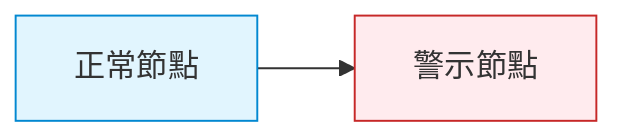
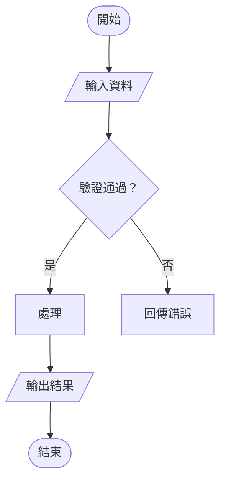
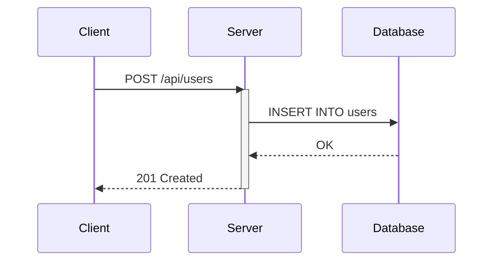
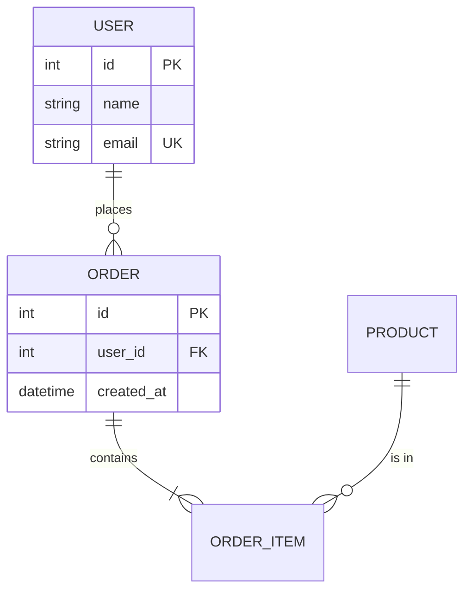
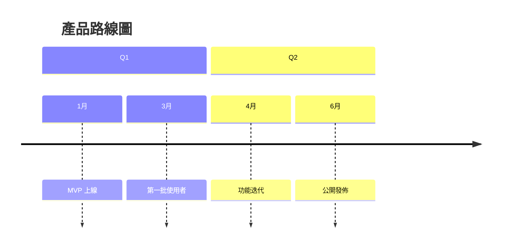
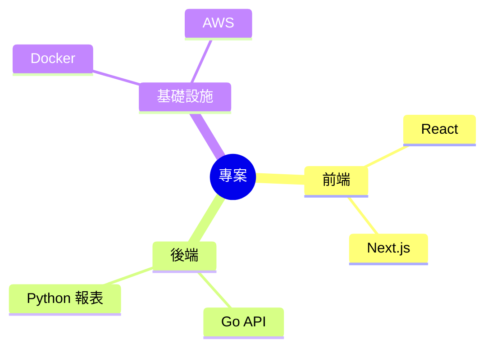
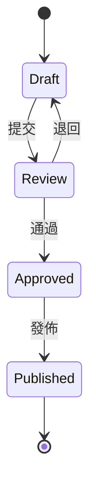
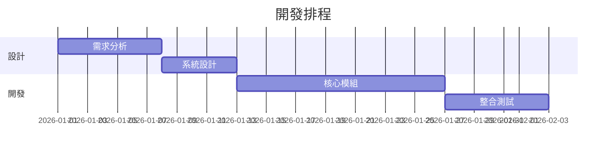

# Mermaid 圖表指引

## 目錄

1. [選型決策表](#選型決策表)
2. [通用規則](#通用規則)
3. [常用圖表語法](#常用圖表語法)
4. [平台相容性](#平台相容性)

---

## 選型決策表

| 你要表達什麼 | 用哪種圖 | 關鍵字 |
|------------|---------|--------|
| 步驟流程、決策邏輯 | `flowchart` | 流程、判斷、分支 |
| 元件互動、API 呼叫 | `sequenceDiagram` | 請求、回應、時序 |
| 資料模型、表關係 | `erDiagram` | Entity、關聯、FK |
| 時間軸、里程碑 | `timeline` | 日期、版本、歷史 |
| 專案排程 | `gantt` | 時間軸 + 任務 |
| 概念分類、心智圖 | `mindmap` | 階層、分支、分類 |
| 系統架構、元件圖 | `graph LR` | 服務、連接、部署 |
| 狀態變遷 | `stateDiagram-v2` | 狀態、轉換、事件 |
| 類別關係、繼承 | `classDiagram` | OOP、介面、繼承 |
| 圓餅圖 | `pie` | 佔比、分佈 |
| Git 分支策略 | `gitGraph` | branch、commit、merge |

> [!TIP]
> 不確定用哪種？預設 `flowchart TD`（垂直流程）最萬用。

---

## 通用規則

### 必做

- 圖表前後空行
- 節點 ID 用 `snake_case`
- 標籤用中文（面向讀者）
- 保持簡潔：單張圖 < 15 個節點

### 禁止

- ❌ `%%{init}` 指令（GitHub dark mode 會壞）
- ❌ 行內 `style` 屬性（用 `classDef` 替代）
- ❌ 超過 20 個節點的單張圖（拆分）

### 樣式建議



---

## 常用圖表語法

### Flowchart（流程圖）



**節點形狀速查**：

| 語法 | 形狀 | 用途 |
|------|------|------|
| `[文字]` | 矩形 | 一般步驟 |
| `([文字])` | 圓角 | 開始/結束 |
| `{文字}` | 菱形 | 判斷 |
| `[/文字/]` | 平行四邊形 | 輸入/輸出 |
| `[[文字]]` | 雙框 | 子流程 |
| `((文字))` | 圓形 | 連接點 |

**方向**：`TD`（上到下）、`LR`（左到右）、`BT`（下到上）、`RL`（右到左）

---

### Sequence Diagram（序列圖）



**箭頭類型**：

| 語法 | 意義 |
|------|------|
| `->>` | 同步請求（實線） |
| `-->>` | 回應（虛線） |
| `--)` | 非同步訊息 |
| `--x` | 失敗/拒絕 |

**區塊**：

```
alt 條件 A
    步驟
else 條件 B
    步驟
end

loop 每 5 秒
    步驟
end

opt 可選
    步驟
end
```

---

### ER Diagram（實體關係圖）



**關係符號**：

| 語法 | 意義 |
|------|------|
| `\|\|--\|\|` | 一對一 |
| `\|\|--o{` | 一對多 |
| `}o--o{` | 多對多 |

---

### Timeline（時間軸）



---

### Mindmap（心智圖）



---

### State Diagram（狀態圖）



---

### Gantt（甘特圖）



---

## 平台相容性

| 平台 | 支援度 | 備註 |
|------|--------|------|
| GitHub | ✅ 完整 | 原生支援所有類型 |
| GitLab | ✅ 完整 | 原生支援 |
| VS Code | ✅ 需套件 | Markdown Preview Mermaid |
| Notion | ⚠️ 部分 | 需用 code block 嵌入 |
| Obsidian | ✅ 完整 | 原生支援 |
| HackMD | ✅ 完整 | 原生支援 |

> [!IMPORTANT]
> 如果目標平台不確定，使用 `flowchart` + `sequenceDiagram` + `erDiagram` 三種最安全。
