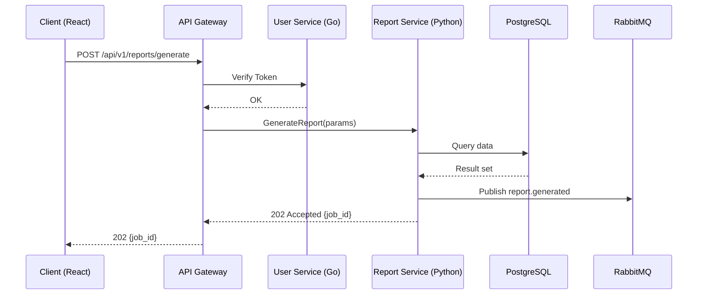

# Skill: generate-uml

## 說明

產出 Mermaid 格式的 UML 圖表，用於系統設計文件。

## 支援圖表類型

| 類型 | 用途 | Mermaid 語法 |
|------|------|-------------|
| 序列圖 | API 流程、元件互動 | `sequenceDiagram` |
| 類別圖 | Domain Model、介面定義 | `classDiagram` |
| ERD | 資料庫 Schema | `erDiagram` |
| 流程圖 | 業務流程、決策樹 | `flowchart` |
| 元件圖 | 系統架構總覽 | `graph` |

## 使用方式

當需要產出設計圖時，依以下規則選擇圖表類型：

1. **描述 API 互動流程** → 序列圖
2. **描述資料模型關係** → ERD
3. **描述系統元件與依賴** → 元件圖（flowchart LR）
4. **描述業務邏輯分支** → 流程圖
5. **描述類別/介面繼承** → 類別圖

## 輸出格式

```markdown
## {圖表標題}

```mermaid
{diagram_content}
```

### 說明
- {圖表重點解讀}
```

## 範例：微服務序列圖



## 品質要求

- 參與者命名：`{簡稱} as {全名} ({技術})`
- 訊息標註：含 HTTP Method 或 gRPC method
- 非同步用虛線箭頭 `-->>`
- 複雜流程用 `alt/opt/loop` 區塊
